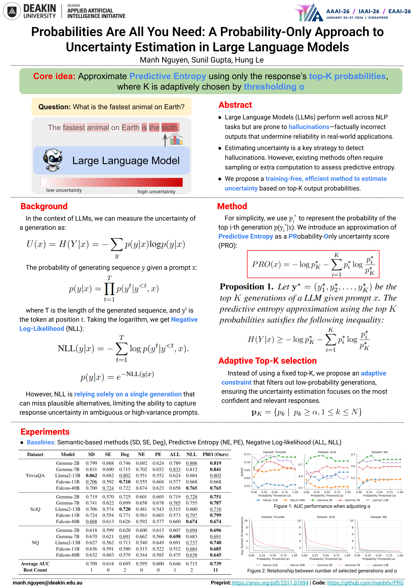

# PRO (AAAI 2026)

**Probabilities Are All You Need: A Probability-Only Approach to Uncertainty Estimation in Large Language Models** 

- Versions: [Proceeding](https://ojs.aaai.org/index.php/AAAI/article/view/40531) | [arXiv:2511.07694](https://arxiv.org/abs/2511.07694)

---


---

### 🧩 Summary

**Uncertainty estimation** plays a central role in detecting hallucinations and improving reliability in Large Language Models (LLMs). Traditional approaches, such as **predictive entropy** or **semantic entropy**, often require multiple samples or additional computation. We propose **PRO (PRobability-Only)**, an efficient, training-free uncertainty estimation method that approximates predictive entropy using __only the responses' top-K probabilities__. Moreover, we employ an __adaptive mechanism to determine K__ to enhance flexibility and filter out low-confidence probabilities. By aggregating response-level probabilities, PRO outperforms expensive baselines across multiple QA datasets, advancing LLM reliability and trustworthiness.

## 🛠️ Environment Setup

Create a conda environment from the provided YAML file:

```bash
conda create -n pro-env python=3.10 pytorch=2.1 torchvision torchaudio pytorch-cuda=11.8 -c pytorch -c nvidia
conda activate pro-env
pip install -r requirements.txt
```
Ensure that the appropriate model weights (e.g., `gemma-2b`) are available locally or accessible via HuggingFace Hub. Before running any scripts, make sure to **update file paths** in `config.py` according to your local directory structure.

## 🗂️ 1. Parse Datasets

Data sources:
* TriviaQA is loaded directly from the HuggingFace Hub.
* SciQ and Natural Questions (NQ) are downloaded from [LitCab](https://github.com/launchnlp/LitCab). 

After downloading, all datasets are preprocessed:
```bash
# TriviaQA
python parse_trivia_qa.py --model='gemma-2b'

# SciQ and Natural Questions
python parse_datasets.py --model='gemma-2b' --dataset='sciq'
python parse_datasets.py --model='gemma-2b' --dataset='nq'
```

## 🧠 2. Beam Search Generation
Generate multiple completions per prompt using beam search.

```bash
# TriviaQA (10% of data)
python generation/generate_triviaqa.py \
  --num_generations_per_prompt=10 \
  --model='gemma-2b' \
  --fraction_of_data_to_use=0.1 \
  --num_beams=10 --top_p=1.0 \
  --dataset='trivia_qa'

# SciQ (full dataset)
python generation/generate_all_datasets.py \
  --num_generations_per_prompt=10 \
  --model='gemma-2b' \
  --fraction_of_data_to_use=1.0 \
  --num_beams=10 --top_p=1.0 \
  --dataset='sciq'

# NQ (50% of data)
python generation/generate_all_datasets.py \
  --num_generations_per_prompt=10 \
  --model='gemma-2b' \
  --fraction_of_data_to_use=0.5 \
  --num_beams=10 --top_p=1.0 \
  --dataset='nq'
```

## 📊 3. Evaluation and Analysis
🔍 Semantic Similarity and Likelihood
```bash
# Semantic similarities
python analysis/get_semantic_similarities.py --generation_model='gemma-2b' --dataset={dataset_name}

# Likelihood
python analysis/get_likelihoods.py --evaluation_model='gemma-2b' --generation_model='gemma-2b' --dataset={dataset_name}

# RougeL for correctness computation
python analysis/calculate_rouge.py --model='gemma-2b' --dataset={dataset_name}
```

## ✅ PRO Score (Ours)
```bash
python pro.py --model='gemma-2b' --dataset={dataset_name}
```

## 📉 Baselines for Comparison
```bash
# Semantic Density
python baselines/get_semantic_density.py --generation_model='gemma-2b' --dataset={dataset_name}

# Other baselines
python baselines/compute_confidence.py --generation_model='gemma-2b' --evaluation_model='gemma-2b' --dataset={dataset_name}

# Final results
python baselines/analyze_results.py --dataset={dataset_name} --model='gemma-2b'
```

## 📓 Example Workflow
```bash
bash run.sh
```
## Citation
```bash
@inproceedings{nguyen2025probabilities,
  title={Probabilities Are All You Need: A Probability-Only Approach to Uncertainty Estimation in Large Language Models},
  author={Nguyen, Manh and Gupta, Sunil and Le, Hung},
  booktitle={Proceedings of the AAAI Conference on Artificial Intelligence},
  year={2026},
  pages={32546--32554}
}
```
